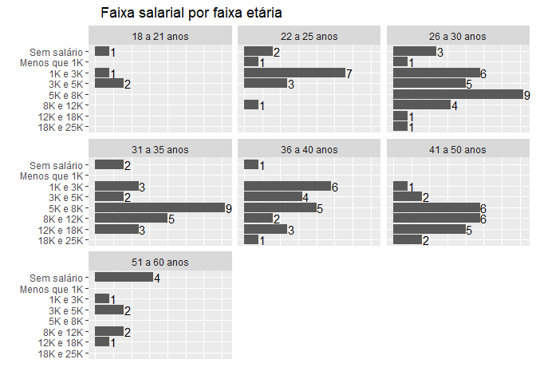
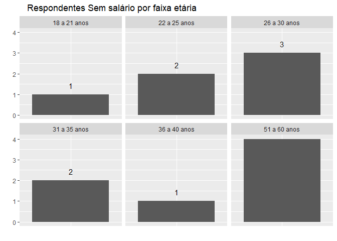
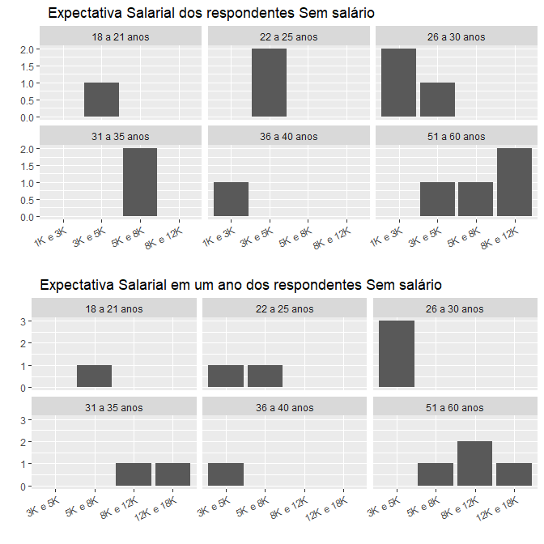
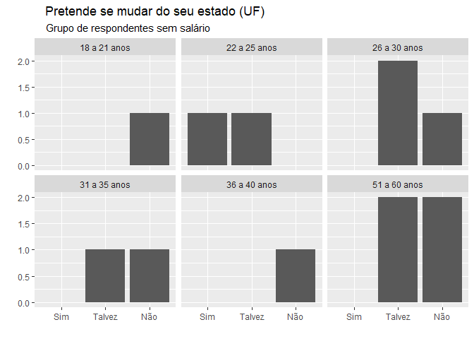
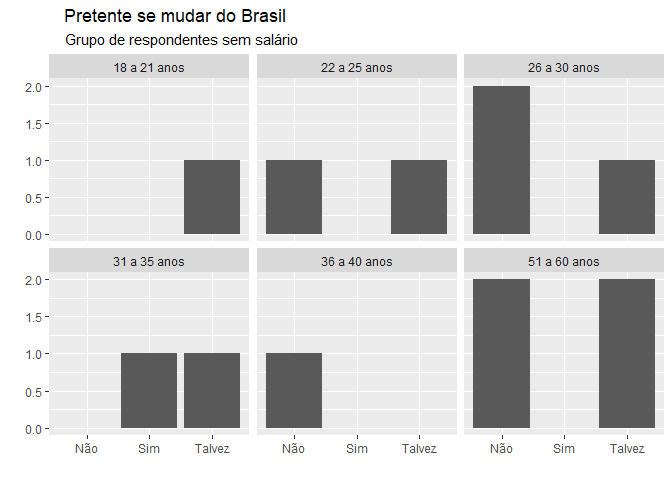

Pesquisa sobre profissionais de um pequeno grupo de TI
================

Build with R 3.6.0

By \* Gabriela Entringe (project owner) e \*\* Marcus Di Paula (R
language).

``` r
# Bibliotecas usadas
library(tidyverse)
library(magrittr)
library(grid)
library(gridExtra)
```

Contato \*: <https://www.linkedin.com/in/gabriela-entringe-2a5202b7/>

Contato \*\*: <https://www.linkedin.com/in/marcusdipaula/>

## Sobre

Este é o resultado de uma pequena pesquisa feita com os profissionais de
TI que se dispuseram a responder a este questionário.

A ideia é tentar mapear um pouco da realidade e das expectativas dos
profissionais da área.

Caso você tenha interesse em contribuir para esta pesquisa, acesse ao
formulário no seguinte link: \<\>.

Ou contate diretamente à Gabi no link de contato acima.

### Resultados

Os resultados desta pesquisa estão dispostos de forma a responder a
alguns questionamentos. Veja a seguir algumas perguntas e suas
respostas.

É importante ressaltar que foi usada uma amostragem não probabilistica
(ou seja, não serve para inferência de parâmetro populacional).

Qual a faixa salarial por faixa etária?

<!-- -->

Qual o percentual de cada grupo de pessoas, separadas por faixa
salarial?

    ## # A tibble: 8 x 3
    ##   faixa_salarial quantas_pessoas percentual_que_representa
    ##   <fct>                    <int>                     <dbl>
    ## 1 18K e 25K                    4                      0.03
    ## 2 12K e 18K                   13                      0.1 
    ## 3 8K e 12K                    20                      0.16
    ## 4 5K e 8K                     29                      0.23
    ## 5 3K e 5K                     20                      0.16
    ## 6 1K e 3K                     25                      0.2 
    ## 7 Menos que 1K                 2                      0.02
    ## 8 Sem salário                 13                      0.1

## Explorando os dados do grupo Sem salário

Vamos olhar novamente para um gráfico já plotado, porém somente para os
respondentes Sem salário atualmente:

<!-- -->

É importante destacar que temos respondentes desempregados que possuem
alguma fonte de renda. A seguir a renda de todos os respondentes que se
declararam Desempregados:

    ## # A tibble: 5 x 3
    ##   renda        quantas_pessoas percentual_que_representa
    ##   <fct>                  <int>                     <dbl>
    ## 1 8K e 12K                   1                      0.06
    ## 2 3K e 5K                    1                      0.06
    ## 3 1K e 3K                    1                      0.06
    ## 4 Menos que 1K               2                      0.11
    ## 5 Sem salário               13                      0.72

Vamos nos ater aos que não tem fonte de renda por enquanto. Qual o
percentual dos respondentes Sem salário atualmente, por faixa etária?

    ## # A tibble: 6 x 3
    ##   faixa_etaria quantas_pessoas percentual_que_representa
    ##   <chr>                  <int>                     <dbl>
    ## 1 18 a 21 anos               1                      0.08
    ## 2 22 a 25 anos               2                      0.15
    ## 3 26 a 30 anos               3                      0.23
    ## 4 31 a 35 anos               2                      0.15
    ## 5 36 a 40 anos               1                      0.08
    ## 6 51 a 60 anos               4                      0.31

Qual a expectativa salarial de quem não tem renda agora e a pretensão
salarial deste mesmo grupo em um ano?

<!-- -->

A faixa salarial de maior percentual, seja de uma pretensão imediata ou
em 1 ano, é entre 3K e 5K, para o grupo de Sem salário:

  - Pretensão salarial imediata do grupo Sem salário:

<!-- end list -->

    ## # A tibble: 4 x 3
    ##   pretensao_salarial quantas_pessoas percentual_que_representa
    ##   <chr>                        <int>                     <dbl>
    ## 1 1K e 3K                          3                      0.23
    ## 2 3K e 5K                          5                      0.38
    ## 3 5K e 8K                          3                      0.23
    ## 4 8K e 12K                         2                      0.15

  - Pretensão salarial em 1 ano do grupo Sem salário:

<!-- end list -->

    ## # A tibble: 4 x 3
    ##   pretensao_em_1_ano quantas_pessoas percentual_que_representa
    ##   <fct>                        <int>                     <dbl>
    ## 1 3K e 5K                          5                      0.38
    ## 2 5K e 8K                          3                      0.23
    ## 3 8K e 12K                         3                      0.23
    ## 4 12K e 18K                        2                      0.15

Qual a formação de quem está Sem salário?

    ## # A tibble: 5 x 3
    ##   formacao       quantas_pessoas percentual_que_representa
    ##   <fct>                    <int>                     <dbl>
    ## 1 Ensino Médio                 2                      0.15
    ## 2 Ensino Técnico               1                      0.08
    ## 3 Graduação                    6                      0.46
    ## 4 Especialização               3                      0.23
    ## 5 Mestrado                     1                      0.08

A maioria tem a graduação. Vamos a uma rápida comparação com o grupo de
pessoas com a mais alta fonte de renda:

  - Formação do grupo Sem salário:

<!-- end list -->

    ## # A tibble: 5 x 3
    ##   formacao       quantas_pessoas percentual_que_representa
    ##   <fct>                    <int>                     <dbl>
    ## 1 Ensino Médio                 2                      0.15
    ## 2 Ensino Técnico               1                      0.08
    ## 3 Graduação                    6                      0.46
    ## 4 Especialização               3                      0.23
    ## 5 Mestrado                     1                      0.08

  - Formação do grupo que recebe os salarios mais altos (12K a 25K):

<!-- end list -->

    ## # A tibble: 4 x 3
    ##   formacao       quantas_pessoas percentual_que_representa
    ##   <fct>                    <int>                     <dbl>
    ## 1 Ensino Médio                 2                     0.12 
    ## 2 Graduação                    5                     0.290
    ## 3 Especialização               6                     0.35 
    ## 4 Mestrado                     4                     0.24

A formação da maioria dos que tem as maiores fontes de renda é
Especialização. As faixas salariais consideradas foram ‘12K e 18K’ e
‘18K e 25K’.

E quem tem doutorado, está ganhando quanto?

    ## # A tibble: 1 x 4
    ##   formacao  faixa_salarial faixa_etaria quantas_pessoas
    ##   <fct>     <fct>          <chr>                  <int>
    ## 1 Doutorado 5K e 8K        31 a 35 anos               1

Quem está Sem salário atualmente, pretende se mudar do seu estado (UF)?

<!-- -->

O quanto isso representa em termos percentuais?

    ## # A tibble: 10 x 4
    ## # Groups:   faixa_etaria [6]
    ##    faixa_etaria mudar_UF quantas_pessoas percentual_que_representa
    ##    <chr>        <chr>              <int>                     <dbl>
    ##  1 18 a 21 anos Não                    1                      0.08
    ##  2 22 a 25 anos Sim                    1                      0.08
    ##  3 22 a 25 anos Talvez                 1                      0.08
    ##  4 26 a 30 anos Não                    1                      0.08
    ##  5 26 a 30 anos Talvez                 2                      0.15
    ##  6 31 a 35 anos Não                    1                      0.08
    ##  7 31 a 35 anos Talvez                 1                      0.08
    ##  8 36 a 40 anos Não                    1                      0.08
    ##  9 51 a 60 anos Não                    2                      0.15
    ## 10 51 a 60 anos Talvez                 2                      0.15

Independente da faixa etária, qual a distribuição de respostas para a
mudança de estado, do grupo atualmente Sem salário?

    ## # A tibble: 3 x 3
    ##   mudar_UF quantas_pessoas percentual_que_representa
    ##   <chr>              <int>                     <dbl>
    ## 1 Não                    6                      0.46
    ## 2 Sim                    1                      0.08
    ## 3 Talvez                 6                      0.46

E quanto a se mudar do Brasil?

<!-- -->

Independente da faixa etária, qual a distribuição de respostas para a
mudança de estado, do grupo atualmente Sem salário?

    ## # A tibble: 3 x 3
    ##   mudar_BR quantas_pessoas percentual_que_representa
    ##   <chr>              <int>                     <dbl>
    ## 1 Não                    6                      0.46
    ## 2 Sim                    1                      0.08
    ## 3 Talvez                 6                      0.46

Apesar de haver diferenças quanto à mudança de estado e saída do país,
quando observamos por faixas etárias, vemos que o percentual efetivo do
‘sim’ é muito pequeno (tanto para quem mudaria de estado ou do país),
representando apenas 8% no grupo de respondentes Sem salário.
